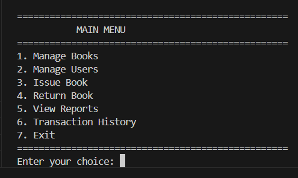
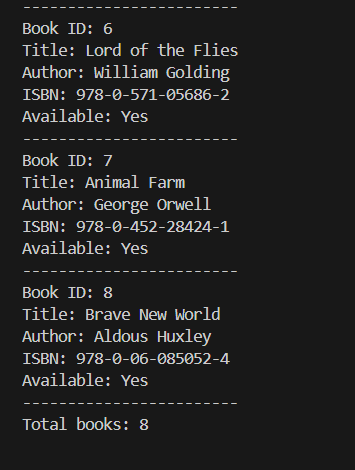
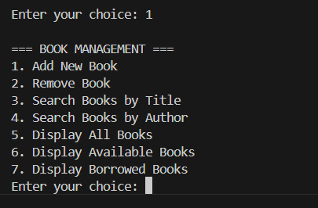
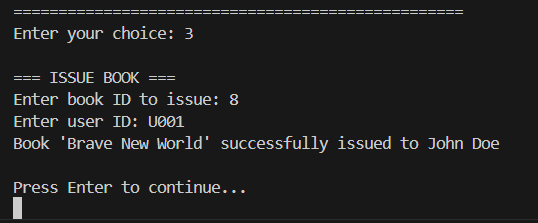
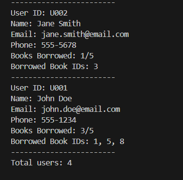
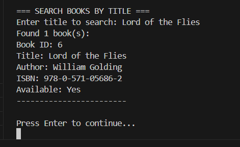
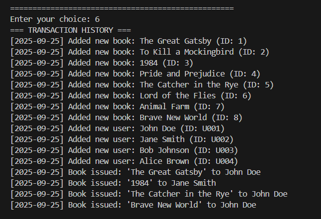
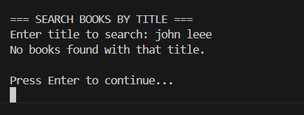

# Library Management System

A comprehensive Java-based Library Management System implementing Object-Oriented Programming principles.

## Project Overview

This system manages books and users in a library environment, providing functionality for book issuing, returning, and comprehensive library management operations.

## Features

### Core Functionality
- **Book Management**: Add, remove, search, and display books
- **User Management**: Register users, manage user accounts
- **Book Operations**: Issue books to users and handle returns
- **Search Functionality**: Find books by title or author
- **Transaction History**: Track all library operations with timestamps
- **User Borrowing Limits**: Configurable maximum books per user
- **Error Handling**: Comprehensive validation and error messages

### Advanced Features
- Menu-driven interactive interface
- Statistical reports and analytics
- Transaction logging with timestamps
- Book availability tracking
- User borrowing history
- Sample data pre-loaded for immediate testing

## Classes and Structure

### 1. Book Class (`Book.java`)
- **Properties**: bookId, title, author, ISBN, availability status, borrowedBy
- **Methods**: 
  - Constructors and getter/setter methods
  - `issueBook()` - Mark book as borrowed
  - `returnBook()` - Mark book as available
  - `displayBookInfo()` - Show book details

### 2. User Class (`User.java`)
- **Properties**: userId, name, email, phoneNumber, borrowedBooks list, maxBooksAllowed
- **Methods**:
  - Constructors with configurable book limits
  - `canBorrowMoreBooks()` - Check borrowing eligibility
  - `borrowBook()` and `returnBook()` - Manage borrowed books
  - `displayUserInfo()` - Show user details and borrowed books

### 3. Library Class (`Library.java`)
- **Properties**: libraryName, books collection, users collection, transaction history
- **Methods**:
  - Book management: `addBook()`, `removeBook()`, `findBooksByTitle()`, `findBooksByAuthor()`
  - User management: `addUser()`, `removeUser()`, `findUserById()`
  - Library operations: `issueBook()`, `returnBook()`
  - Display methods: Various reporting and statistics functions
  - Transaction logging with timestamps

### 4. Main Application
- **LibraryManagementSystem.java**: Interactive menu-driven interface with complete functionality

## Screenshots and Output Examples

### Interactive Menu Interface

*Main menu interface showing all available options*

### Library Statistics

*Library statistics showing total books, users, and current status*

### Book Management

*Book management interface for adding, removing, and searching books*

### Book Issue/Return Operations

*Demonstration of book issuing and returning functionality*

### User Management

*User management interface showing registered users and their borrowed books*

### Search Functionality

*Search results showing books found by title or author*

### Transaction History

*Complete transaction log with timestamps showing all library operations*

### Error Handling

*Examples of error handling for invalid operations*

## System Capabilities

### Book Management
- Add new books with automatic ID assignment
- Remove books (only if not currently borrowed)
- Search books by title or author (case-insensitive)
- Display all books, available books, or borrowed books

### User Management
- Register new users with unique IDs
- Remove users (only if no borrowed books)
- Set custom borrowing limits per user
- Track user borrowing history

### Library Operations
- Issue books to registered users
- Handle book returns
- Validate all operations (user exists, book available, etc.)
- Prevent duplicate borrowing and invalid operations

### Reporting and Analytics
- Library statistics (total books, available/borrowed counts)
- User borrowing reports
- Complete transaction history with timestamps
- Search and filter capabilities

## Error Handling

The system includes comprehensive error handling for:
- Non-existent books or users
- Already borrowed books
- Users exceeding borrowing limits
- Invalid return attempts
- Duplicate registrations

## Sample Data

The system includes sample data initialization with:
- 8 classic books from various authors
- 4 registered users with different profiles
- Pre-issued books to demonstrate functionality

## Object-Oriented Features

- **Encapsulation**: Private fields with public getter/setter methods
- **Data Abstraction**: Clean interfaces hiding implementation details
- **Modularity**: Separate classes for different entities
- **Polymorphism**: Method overloading in constructors
- **Error Handling**: Exception handling and validation
- **Collections**: Use of ArrayList and HashMap for data management

## Future Enhancements

Potential improvements could include:
- Due date tracking and late fee calculation
- Book reservation system
- Database integration
- GUI interface
- Export/import functionality
- Fine management system
- Multiple library locations support

## Author

Created as part of Java OOP learning exercises, demonstrating practical application of object-oriented programming principles in a real-world scenario.
